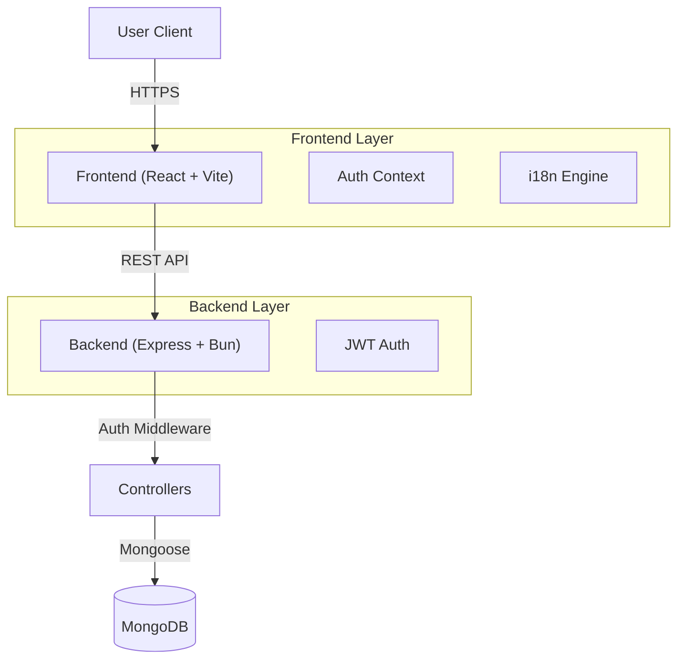

# TaskForge

TaskForge is a modern, high-performance task management application designed to help users organize their daily activities efficiently. Built with a focus on speed and developer experience using the Bun runtime.

[](https://taskforge-demo.vercel.app)

## 📸 Screenshots

| Landing Page | Dashboard |
|:---:|:---:|
|  |  |
| *Modern Landing Page with i18n* | *Task Management Dashboard* |

> *Note: Screenshots are placeholders. Please add actual images to a `docs` folder.*

## 🏗 Architecture

TaskForge follows a clean client-server architecture, separating concerns for scalability and maintainability.



## ⚡ Why Bun?

We chose **Bun** as our runtime and package manager for several compelling reasons:

1.  **Performance**: Bun's startup time is significantly faster than Node.js, which speeds up development cycles and server restarts.
2.  **All-in-One Toolkit**: Bun acts as a runtime, package manager (replacing npm/yarn), and bundler. This reduces dependency bloat and simplifies our toolchain.
3.  **TypeScript Support**: Bun has first-class support for TypeScript out of the box, eliminating the need for complex `ts-node` or build configurations for the backend.

## 📂 Project Structure

The project is structured as a monorepo to keep frontend and backend code co-located while maintaining clear separation of concerns.

```
taskforge/
├── backend/                 # Express.js API
│   ├── src/
│   │   ├── config/          # Environment & App Config
│   │   ├── controllers/     # Request Handlers
│   │   ├── database/        # DB Connection Logic
│   │   ├── middlewares/     # Auth & Error Handling
│   │   ├── models/          # Mongoose Schemas
│   │   └── routes/          # API Route Definitions
│   └── index.ts             # Entry Point
│
└── frontend/                # React + Vite App
    ├── src/
    │   ├── components/      # Reusable UI Components
    │   ├── context/         # Global State (Auth)
    │   ├── lib/             # API Clients & Utilities
    │   ├── pages/           # Route Views
    │   └── i18n.ts          # Internationalization Config
    └── vite.config.ts       # Vite Configuration
```

## 🚀 Current Features

- **Authentication:** Secure Sign Up/In, JWT-based session management.
- **Task Management:** Full CRUD operations for tasks.
- **Internationalization (i18n):** Full English and Spanish support.
- **Modern UI:** Glassmorphism design, responsive layout, and dark mode.
- **Tech Stack:** React, Tailwind CSS, Express, MongoDB, Bun.

## 🗺 Roadmap

We are constantly improving TaskForge. Here are the next 5 features on our radar:

1.  **Drag & Drop Reordering**: Allow users to prioritize tasks by dragging them.
2.  **Task Categories/Tags**: Add color-coded tags to categorize tasks (e.g., Work, Personal).
3.  **Due Dates & Reminders**: Integration with email notifications for upcoming deadlines.
4.  **User Profile Settings**: Allow users to update their avatar and change passwords.
5.  **Collaborative Workspaces**: Share task lists with other users for team collaboration.

## ⚙️ Environment Variables

Create a `.env` file in the `backend` directory:

```env
PORT=5500
SERVER_URL="http://localhost:5500"
MONGO_URI="your_mongodb_connection_string"
JWT_SECRET="your_jwt_secret_key"
JWT_EXPIRES_IN="1d"
```

## 📦 Installation & Running

1.  **Clone the repository**
2.  **Install Dependencies** (Root, Backend, and Frontend)
    ```bash
    # Backend
    cd backend
    bun install
    
    # Frontend
    cd ../frontend
    bun install
    ```
3.  **Run Development Servers**
    ```bash
    # Terminal 1 (Backend)
    cd backend
    bun run dev
    
    # Terminal 2 (Frontend)
    cd frontend
    bun run dev
    ```
